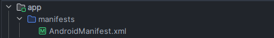
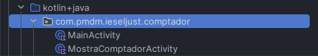
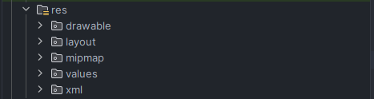
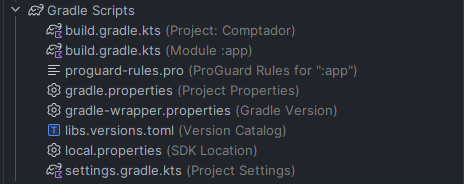
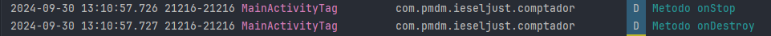
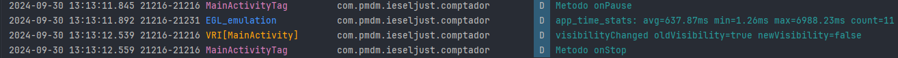
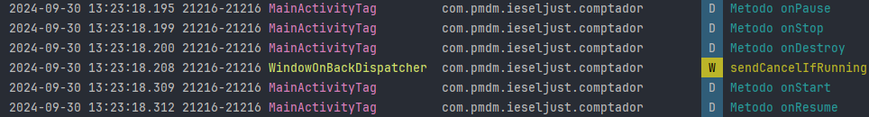

# AEV 1 - COMPTADOR - GEORGI NEDYALKOV VANKOV
***

## 1. Anàlisi de l'estructura del projecte
### Descripción
El proyecto es una aplicación básica para Android con la que podemos aumentar, decrementar y resetear un contador.

Tenemos también un botón con el que abrir una pantalla y que nos muestre el numero o estado actual del contador; Dentro de esta pantalla tenemos un boton con el que volver atras a la pantalla principal.
### Etructura y carpetas más importantes
1. `app:` Este es el módulo principal del proyecto

    1.1 `manifests`
    Podemos encontrar el archivo `AndroidManifest.xml` que define la configuración general de la aplicacion, como el nombre del paquete, las actividades principales y otras configuraciones



2. `kotlin + java:` Módulo que contiene el código fuente de la aplicación

    2.1 `com.pmdm.ieseljust.comptador` en este caso es la carpeta que contiene las classe principales ***(MainActivity: actividad principal de la app)*** del código fuente de la aplicación, en Kotlin



3. `res:` Contiene los recursos de la aplicación, organizados en carpetas

    ***drawable/*** Contiene elementos gráficos que se pueden dibujar en la pantalla del dispositivo, no solo imagenes sino también listas de capas, 
    estados o niveles entre otros.
    
    ***mipmap/*** Contiene los diferentes iconos de la app, en diferentes densidades (ppp)

    ***layout/*** Contiene los diseños de diferentes partes de la interfaz del usuario, en formato XML

    ***values/*** Contiene archivos en formato XML con valores simples, como cadeas de caracteres, valores enteros o colores

    ***menu/*** Archivos XML que definen diferentes tipos de menú de la app

    ***animator/ y anim/*** Archivos XML con diferente tipos de animaciones

    ***color/*** Archivos XML con listas de estados de color, para aplicar sobre diferentes elementos de interficie y que estos cambien según su estado

    ***xml/*** Archivos XML que podemos leer en tiempo de ejecución, con algunas configuraciones especiales

    ***font/*** Carpeta para almacenar tipografias especificas de la app

    ***raw/*** Contiene archivos sin procesar, que tendremos que tratar como streams



4. `Gradle Scripts:` Contiene los archivos de configuración para gestionar la construcción del proyecto
    
    4.1 `build.gradle.kts (Project: Comptador)` Archivo de configuración de nivel de proyecto, que define la configuración general de Gradle

    4.2 `build.gradle.kts (Module :app)` Archivo de configuración de nivel de módulo (en este caso, app), que define las dependencias y configuraciones espeficas del módulo app

    4.3 `gradle-wrapper.properties` Define la versión de Gradle que se usa en el proyecto

    4.5 Otros archivos relacionados con configuraciones de Gradle y propiedades del proyecto (local.properties, settings.gradle.kts, etc.).



## Si volguera afegir una nova activitat, sería suficient crear el fitxer de layout i el fitxer Kotlin amb la classe?
Definitivamente NO. Debemos de hacer algunos pasos más.

- Registrar la nueva actividad en el *AndroidManifest.xml* para que Android la reconozca, es decir una nueva etiqueta *activity* dentro de la etiqueta *aplication* con todos los parametros
- Añadir la lógica de navegación
- Asegurarse de que el layout esté correctamente vinculado dentro del metodo onCreate(), setContentView(R.layout.nombre_de_layout) 


***
## 2. Análisi del clicle de vida i el problema de la pèrdua d'estat
Una vez implementados y sobreescritos los metodos de la classe *Activity* para que nos puedan mostrar los diferentes Log que suceden durante el ciclo de vida de nuestra app, podemos observar lo siguiente:

1. Cuando ejecutamos inicializamos la app en el Logcat nos aparecen estos avisos personalizados: `Metodo onStart` y `Metodo onResume`


2. Si apretamos el botón de *back* de Android Studio nos aparece el mensaje de estos dos meetodos: `Metodo onStop` y `Metodo onDestroy`


3. La volvemos a abrir (salen los mensajes del punto 1). Si apretamos el boton de *home* de Android nos aparecen loss mensajes: `Metodo onPause` y `Metodo onStop`


4. Acto seguido despues del punto 3 la abrimos y nos salen estos mensajes de los siguientes metodos: `Metodo onRestar`, `Metodo onStart` y `Metodo onResume` 


5. Si le damos al botón de girar la pantalla y cambiar la orientación o volver a ponerla como estaba salen los siguientes avisos: `Metodo onPause`, `Metodo onStop`, `Metodo onDestroy`, `Metodo onStart` y `Metodo onResume`

***
## 3. Solució a la pèrdua d'estat
La solución en este caso para por sobreescribir las funciones de la clase onSaveInstanteState y onRestoreInstanceState
```kotlin
    override fun onSaveInstanceState(outState: Bundle) {
        super.onSaveInstanceState(outState)
        outState.putInt("comptador", comptador)
    }

    override fun onRestoreInstanceState(savedInstanceState: Bundle) {
        super.onRestoreInstanceState(savedInstanceState)
        comptador = savedInstanceState.getInt("comptador")
        var textViewComptador = findViewById<TextView>(R.id.textViewComptador)
        textViewComptador.text = comptador.toString()
    }

```
***


## 4. Ampliant la funcionalitat amb decrements i Reset
1. Lo primero de todo tenemos que importar el XML 
2. Una vez tenemos el XML, podemos ir a la classe principal y trabajar sobre ella. Lo primero debemos referenciar estos nuevos elementos
    ```kotlin
    // Referencia al boton de Reset
    val btnReset = findViewById<Button>(R.id.btReset)
    ```
3. Ahora a este botón nuevo podemos dotarlo de un evento, en este caso cuando se hace click sobre él
    ```kotlin
    btnReset.setOnClickListener {
                comptador = 0
                textViewContador.text = comptador.toString()
            }
    ```
4. Y esto lo hacemos con los demás botones aplicando la lógica necesaria
***
## 5. Canvis per implementar el View Binding
Se ha implementado View Binding al proyecto configurando y cambiando los metodos necesarios para su correcto funcionamiento
